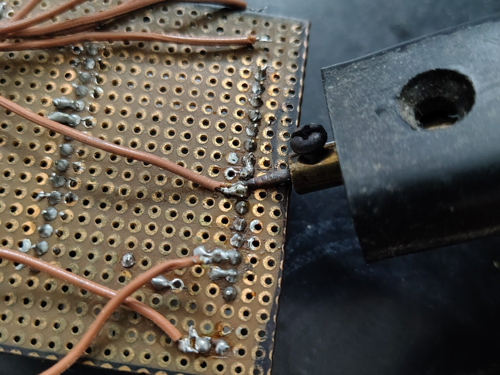
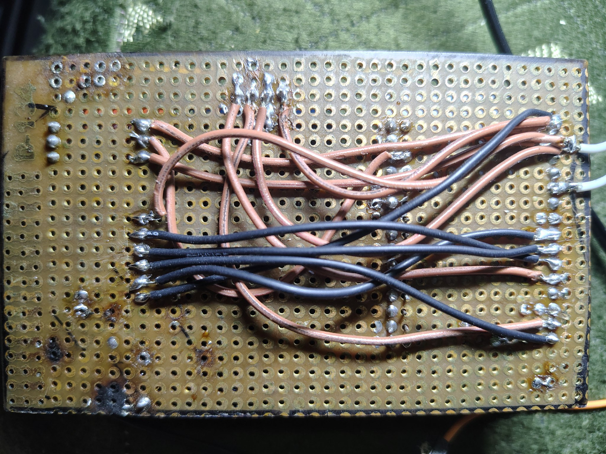
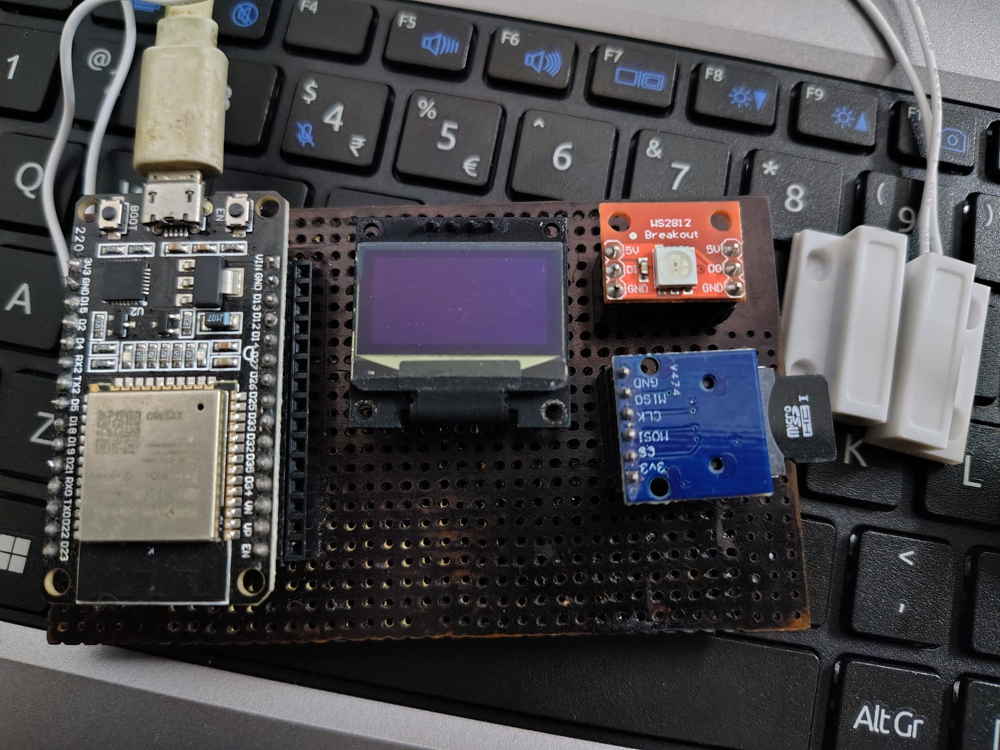
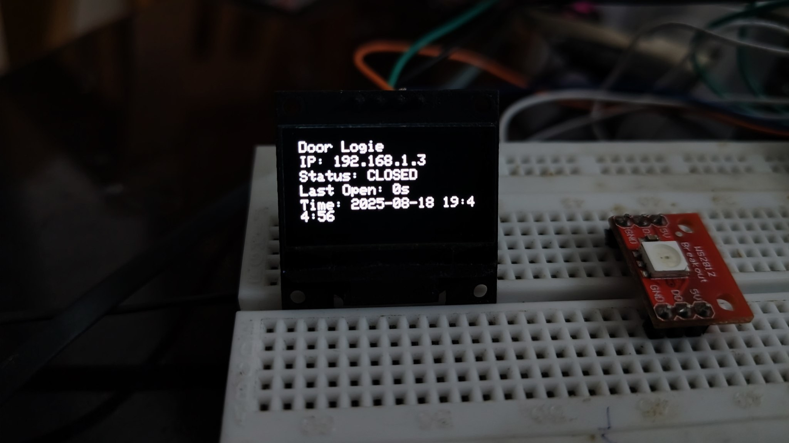
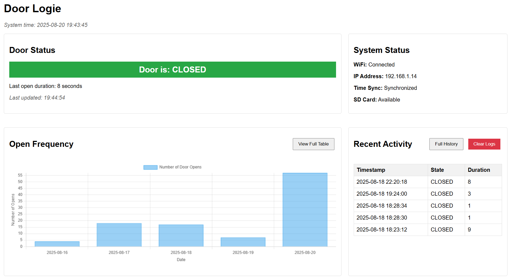

# DoorLogie 🚪

**DoorLogie** is a lightweight yet complete **smart door AMS** powered by the **ESP**.  
It goes beyond a basic door logger by combining a clear visual interface, reliable event logging, and network accessibility for real-world deployment.  

``` Read till the end... thwanks hooman! ```

## Demo and Progress

### Real Deployment in a Door  

https://github.com/user-attachments/assets/14111a1c-625a-42b4-9a51-888faa28a019

https://github.com/user-attachments/assets/7e14dbcf-538d-4791-ba55-53bce2b46384


## Features :

- **OLED Display (128×64)** – real-time door status, system messages, and logs  
- **NeoPixel Indicator** – instant visual feedback for door state and device health  
- **Custom Icons** – intuitive UI for Wi-Fi, time sync, and system states  
- **mDNS Support** – access the device using a friendly hostname instead of raw IP  
- **Wi-Fi Logging** – optional integration with online dashboards for remote monitoring  
- **Local Logging** – event storage that works even when offline  
- **Hardware Evolution** – designed on breadboard, migrated to perfboard, and deployed for real-world use  

### OLED Previews :
<p align="center">
  
</p>  


## Hardware Progress :  
Started on a simple **breadboard prototype**, then moved to a **perfboard soldered build** for stability.
<p align="center">
  
  
  
</p>  


### Devlogs (Journey of DoorLogie)  

#### Log 1

https://github.com/user-attachments/assets/ed13d360-687d-4363-b320-8151eb42f610

#### Log 2



#### Log 3

https://github.com/user-attachments/assets/5a8e2d3d-f815-4800-88b0-5ba6181135f6

#### Log 4

https://github.com/user-attachments/assets/03f1cce0-c73c-4435-9b33-ffcfcf5aa363

#### Log 5



#### Log 6


---


## How to setup DoorLogie?

### 1. Clone this repo
```bash
git clone https://github.com/gcloud0x1/doorlogie
cd doorlogie
```

### 2. Create credentials.h
```bash
touch credentials.h
```

### 3. Add Wi-Fi credentials
```bash
#ifndef CREDENTIALS_H
#define CREDENTIALS_H

const char* WIFI_SSID = "YOUR_SSID";
const char* WIFI_PASS = "YOUR_CAT_NAME_ASTEROID_DESTROYER";

#endif
```
### 4. Select your board
| Board   | Status       |
|---------|-------------|
| ESP32   | ✅ Supported |
| ESP8266 | ⚠️ Planned   |

### 5. Upload the code
